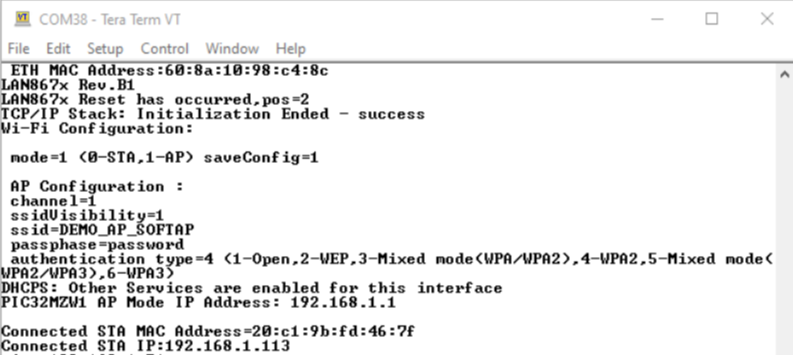

# PIC32MZ_Wi-Fi_10BaseT1S_Bridge

> "IoT Made Easy!" 

Devices: **| RNBD451 |** 
Features: **| Wi-Fi | 10BaseT1S |**

## ⚠ Disclaimer

<b>
THE SOFTWARE ARE PROVIDED "AS IS" AND GIVE A PATH FOR SELF-SUPPORT AND SELF-MAINTENANCE. This repository contains example code intended to help accelerate client product development.  

For additional Microchip repos, see: <a href="https://github.com/Microchip-MPLAB-Harmony" target="_blank">https://github.com/Microchip-MPLAB-Harmony</a>

Checkout the <a href="https://microchipsupport.force.com/s/" target="_blank">Technical support portal</a> to access our knowledge base, community forums or submit support ticket requests.

</b>

## Contents

1. [Introduction](#step1)
1. [Bill of materials](#step2)
1. [Software Setup](#step3)
1. [Hardware Setup](#step4)
1. [Harmony MCC Configuration](#step5)
1. [Board Programming](#step6)
1. [Run the demo](#step7)

## 1. Introduction<a name="step1">

This application enables us to develop a Wi-Fi and 10BaseT1S bridge in WFI32 Curiosity board. Bridging function connects two separate networks as if they were a single network. In the OSI model, bridging is performed in the data link layer (layer 2).With one or more wireless segments in the bridged network, the device can be called a wireless bridge.

 The L2 bridging implementation is according to the IEEE 802.1D - 2004 standard document. It is recommended to read the standard to understand the purpose and implementation of the software module. For more information please go through this [application](https://github.com/MicrochipTech/PIC32MZW1_Ethernet_WIFI_Bridge).

WFI32 Curiosity Board set as an AP can be used as a Wireless Bridge connecting multiple wireless and wired networks to form a single network. Here a Wi-Fi and 10BaseT1S bridge is created using L2 bridging.

## 2. Bill of materials<a name="step2">

| TOOLS | QUANTITY |
| :- | :- |
| [PIC32 WFI32E Curiosity Board](https://www.microchip.com/en-us/development-tool/ev12f11a) | 1 |
| [EVB-LAN8670-RMII](https://www.microchip.com/en-us/development-tool/EV06P90A) | 2 |
| [SAM E54 CURIOSITY ULTRA DEVELOPMENT BOARD](https://microchip.com/en-us/development-tool/dm320210) | 1 |

## 3. Software Setup<a name="step3">

- [MPLAB X IDE ](https://www.microchip.com/en-us/tools-resources/develop/mplab-x-ide#tabs)

    - Version: 6.15
	- XC32 Compiler v4.10
	- MPLAB® Code Configurator v5.4.1
	- PIC32MZ-W_DFP v1.8.326
	- MCC Harmony
	  - csp version: v3.18.0
	  - dev_packs: v3.18.0
	  - net_10base_t1s: vv1.3.0
	  - wireless_wifi: v3.9.1
	  - wireless_system_pic32mzw1_wfi32e01: v3.8.0
	  - wolfssl: v5.4.0
	  - net: v3.10.1
	  - crypto: v3.8.1
	  - CMSIS-FreeRTOS: v10.5.1
	  - core version: v3.13.1

- Any Serial Terminal application like [TERA TERM](https://download.cnet.com/Tera-Term/3000-2094_4-75766675.html) terminal application

- [MPLAB X IPE v6.10](https://microchipdeveloper.com/ipe:installation)

## 4. Hardware Setup<a name="step4">

- Computer connected to [WFI32 Curiositiy board](https://www.microchip.com/DevelopmentTools/ProductDetails/PartNO/EV12F11A) over USB POWER (J204)
- J202 = VBUS
- J301 = open

USB-to-UART cable between the computer and GPIO Header UART1 pins (Rx, GND, Tx) to observe the console logs.

- LAN867x PHY Daughter Board plugged in WFI32 Cursiotiy Board through J208.
- LAN867x PHY Daughter Board plugged in SAME54 Cursiotiy Ultra Board through J802.
- Establish a physical wiring between the two 10BASE-T1S nodes. 

## 5. Harmony MCC Configuration<a name="step5">

### Getting started with 10BaseT1S to Wi-Fi Bridge application in WFI32 Curiosity board 

| Tip | New users of MPLAB Code Configurator are recommended to go through the [overview](https://onlinedocs.microchip.com/pr/GUID-1F7007B8-9A46-4D03-AEED-650357BA760D-en-US-6/index.html?GUID-B5D058F5-1D0B-4720-8649-ACE5C0EEE2C0) |
| :- | :- |

**Step 1** - Connect the WFI32 Curiosity board setup to the device/system using a micro-USB cable.

**Step 2** - Create a new MCC Harmony project.

**Step 3** - The "MCC - Harmony Project Graph" below depicts the harmony components utilized in this project.

- From Device resources, go to Wireless->System Services and select WIFI service. Accept all Dependencies or satisfiers, select "Yes". 

- Select WIFI service component and configure as shown below. Please note while unchecking the STA mode check box, select "No" to all deactivate the DHCP and DNS components pop up.

- In Application layer view, select TCP/IP Applicaion layer configurator and add SNTP and IPERF.

- In Network layer view, select ICMPv4 and configure as follows.

- In System Configuration view, select UART1 and configure as follows.

- In System Configuration view, select Netconfig and add second MAC instance. Right click on the "⬦" on Instance 1 MAC and select ETHMAC. Right click on the "⬦" on ETHMAC and select LAN867x. Right click on the "⬦" on LAN867x and add MIIM driver. The configurations are depicted as follows.

- In System Configuration view, select wolfCrypt Library and right click on the "⬦" on LIB_WOLFCRYPT and add Cryptographic library.

- In System Configuration view, select Netconfig Instance 0 MAC and configure as follows.

- In System Configuration view, select Netconfig Instance 1 MAC and configure as follows.

- In System Configuration view, select Netconfig and configure as follows.

- From project graph, go to Plugins->PIN configuration and configure as follows.

**Step 4** - [Generate](https://onlinedocs.microchip.com/pr/GUID-A5330D3A-9F51-4A26-B71D-8503A493DF9C-en-US-1/index.html?GUID-9C28F407-4879-4174-9963-2CF34161398E) the code.

**Step 5** - Clean and build the project. To run the project, select "Make and program device" button.

### Getting started with 10BaseT1S application in SAME54 Curiositiy Ultra Board.

- Open the 10BaseT1S application(freeRTOS) available in this [link](https://github.com/Microchip-MPLAB-Harmony/net_10base_t1s/tree/master/apps/tcpip_iperf_lan867x/firmware).
- Open MCC configurator. Go to Driver layer view and select Mac Instance 0 in Netconfig and make the changes as shown below.

- Select LAN867x component, expand PLCA settings and make sure the Node Id is set as 1.
- [Generate](https://onlinedocs.microchip.com/pr/GUID-A5330D3A-9F51-4A26-B71D-8503A493DF9C-en-US-1/index.html?GUID-9C28F407-4879-4174-9963-2CF34161398E) the code.
- Clean and build the project. To run the project, select "Make and program device" button.

## 6. Board Programming<a name="step6">

### Program the precompiled hex file using MPLAB X IPE

- The application hex file can be found in the hex folder.

- Follow the steps provided in the link to [program the precompiled hex file](https://microchipdeveloper.com/ipe:programming-device) using MPLABX IPE to program the pre-compiled hex image. 

### Build and program the application using MPLAB X IDE

Follow the steps provided in the link to [Build and program the application](https://github.com/Microchip-MPLAB-Harmony/wireless_apps_pic32cxbz2_wbz45/tree/master/apps/ble/advanced_applications/ble_sensor#build-and-program-the-application-guid-3d55fb8a-5995-439d-bcd6-deae7e8e78ad-section).

## 7. Run the demo<a name="step7">

- Make sure that Node Id, IP Addresses and MAC Addresses of the two nodes are different.
- Press the Reset button on both the devices.
- Type netinfo in the terminal window and check your network information(Make sure the status is ready). 
- Connect your Laptop to the WFI32 AP using the SSID and password displayed in the Terminal application.

- Open Command line in your laptop and enter "ipconfig /all"

 
- Type ping <Ip address of SAME54 node> in the terminal window.

You should get a reply for your request if the Wi-Fi 10BaseT1S Bridge was established. 
- Create an IPERF UDP server on one node; type iperf -s -u in the iperf application in your Laptop. Make sure you use Iperf v2 for this example.
- Create an IPERF UDP client on the SAME54 node; type iperf -c <ip address assigned to the laptop> -u -b 10M in the terminal window.

- You have successfully achieved a 9.328 Mbps throughput on the Wi-Fi and 10BASE-T1S Bridge application.